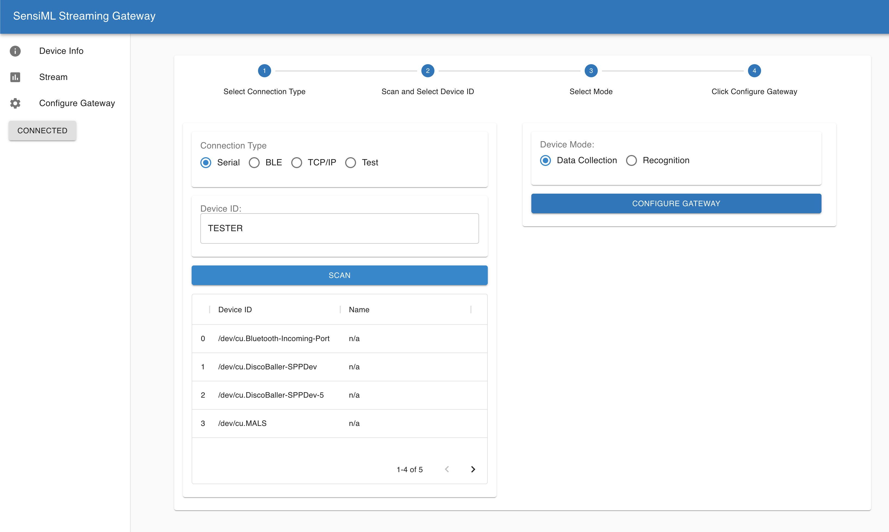
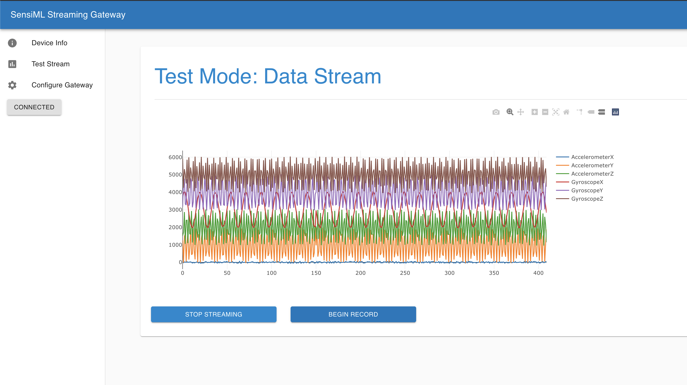
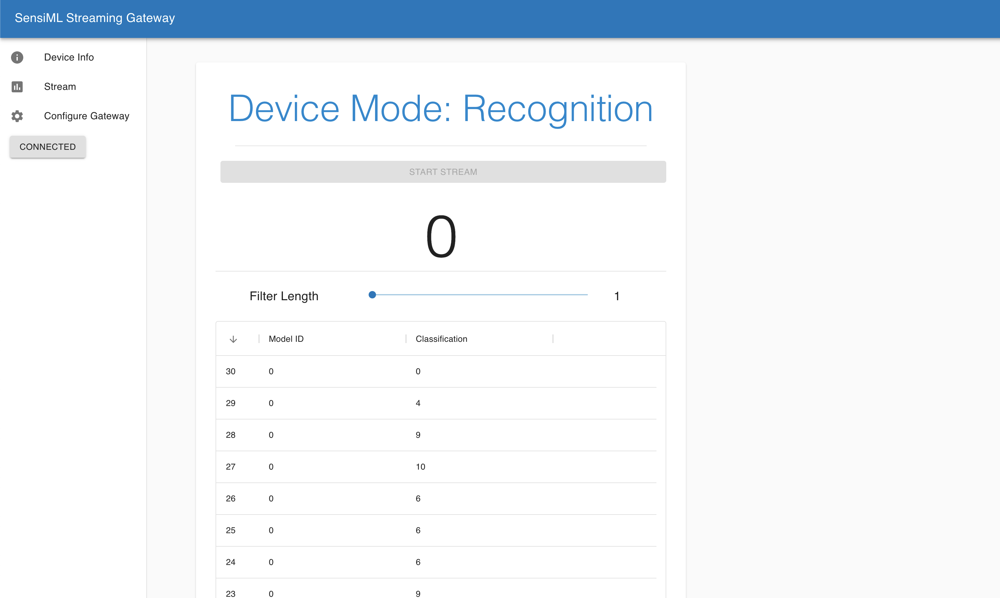

# SensiML Simple Streaming Gateway

This Simple Streaming Gateway implements the Simple Streaming Service Wi-Fi protocol to enable forwarding data to the SensiML Data Capture Lab. The Simple Streaming Gateway supports connecting to sensors sources over a serial or BLE connection.

The Gateway must first be configured to record data from your target sensor. It does that by fetching a configuration file. You can scan for devices connected over serial and configure the Application by fetching the configuration from the connected device.



After fetching the configuration your gateway is ready to stream out data. You can then use the SensiML Data Capture lab to connect and record live sensor data.

You can also use the Gateway to view the live sensor data streams



As well as the results stream



## Installation

To install the app dependencies run

```bash
cd simple-streaming-gateway
pip install -r requirements.txt
```

To Start the application run

```bash
python3 app.py
```

## Installation (Windows, Mac)

Currently the application uses bluepy for BLE connections, which is not supported on windows or Mac. You can still use the gateway application for TCP/IP and Serial connections, but you need to modify the requirements.txt file to not install bluepy. You can do that by removing bluepy as a dependency in requirements.txt. We are looking into adding BLE to Mac/Windows and welcome pull request which add support.

## Data Collection over Serial Source

    1. Connect edge node to Gateway over USB serial
    2. Go to Gateway Configure Screen, Select Serial Radio and Click Scan
    3. Enter the Device ID (which is the port) into the Text Field and Click Configure
    4. The Simple Streaming Gateway is now configured to Stream Data from your Device over Wi-Fi

**NOTE** The BAUD RATE for the serial connection can be changed in the app.py by updating the default BAUD_RATE configuration.

## Data Collection over BLE Source

    1. Connect edge node to Gateway over USB serial
    2. Go to Gateway Configure Screen, Select BLE Radio and Click Scan
    3. Enter the Device ID (which is the port) into the Text Field and Click Configure
    4. The Simple Streaming Gateway is now configured to Stream Data from your Device over Wi-Fi

**NOTE** To use Bluethooth as a source you may have to run the following to allow bluepy-helper to access the correct permissions

```bash
find ~/ -name bluepy-helper
cd <PATH>
sudo setcap 'cap_net_raw,cap_net_admin+eip' bluepy-helper
```

## Data Collection from TCP/IP Source

    1. Connect edge node to network
    2. Go to Gateway Configure Screen, Select TCP/IP Radio Button
    3. Enter the Device ID (address:port) into the Text Field and Click Configure
    4. The Simple Streaming Gateway is now configured to Stream Data from your Device over Wi-Fi

## High Sample Rate Streaming

The settings for the samples per packet is set in the app.py file. For higher sample rates, you may need to adjust this to a larger value. For instance, setting it to 400 will improve streaming for Audio at 16KhZ

## BLE Troubleshooting

### Cycle Bloothooth on Linux

Sometimes your BLE gets stuck in a weird state and you need to reset it. Instead of cycling the power, just run this command in your shell. You may also need to power cycle the device.

```base
rfkill block bluetooth && rfkill unblock bluetooth
```

### Disable onboard bluetooth rpi (if you have a dongle)

We have noticed some issues with the rpi BLE data drivers when using a camera and streaming data. We recommend using a dongle for video capture and ble streaming on the rpi. To disable the onboard BLE

```bash
dtoverlay=disable-bt
```
